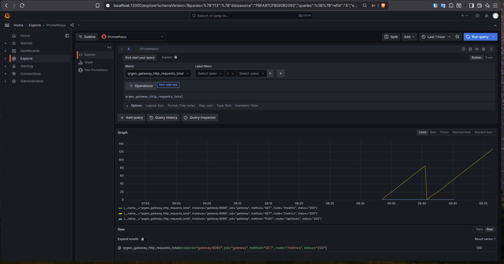
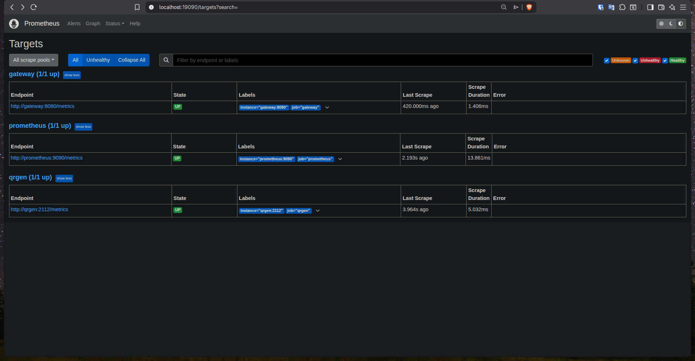

# Отчёт по лабораторной работе

## Общая информация

В качестве основы для выполнения лабораторной работы использовался проект из лабораторной работы 5. Исходный код проекта размещён в репозитории GitHub:

<https://github.com/danluki/qrgen-lab>

## Цель работы

Для микросервисного приложения настроить систему централизованного мониторинга и сбора логов.

## Используемые инструменты

- `Loki` — централизованное хранение логов.
- `Promtail` — сбор логов контейнеров и отправка их в `Loki`.
- `Prometheus` — сбор и хранение метрик сервисов.
- `Grafana` — визуализация метрик и просмотр логов.

## Выполненная работа

В рамках лабораторной работы была настроена централизованная система наблюдаемости для микросервисного приложения:

- реализован сбор логов всех контейнеров в единое хранилище через связку `Promtail + Loki`;
- настроен сбор метрик приложения с помощью `Prometheus`;
- подготовлена визуализация метрик и логов в `Grafana`;
- настроены источники данных и дашборды для отслеживания состояния приложения.

Такой подход позволяет в одном интерфейсе анализировать как технические метрики сервисов, так и журналы их работы.

## Результат

После запуска проекта через `APP_PORT=18080 GRAFANA_PORT=13000 PROMETHEUS_PORT=19090 docker compose up` становятся доступны:

- веб-приложение;
- `Prometheus` для просмотра метрик;
- `Grafana` для визуализации;
- централизованные логи через `Loki`.

## Скриншоты

### Интерфейс Grafana

### Мониторинг и визуализация данных

